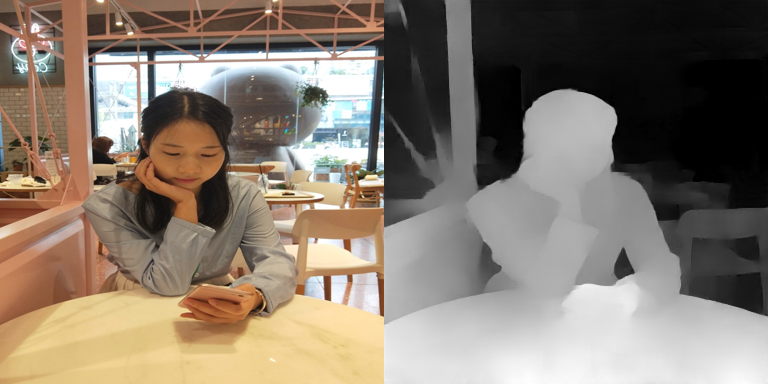

# Zoom and Learn (ZOLE)
This repo includes the test model of the paper:
["Zoom and Learn: Generalizing Deep Stereo Matching to Novel Domains"](http://openaccess.thecvf.com/content_cvpr_2018/papers/Pang_Zoom_and_Learn_CVPR_2018_paper.pdf) by Jiahao Pang, Wenxiu Sun, Chengxi Yang, Jimmy Ren, Ruichao Xiao, Jin Zeng and Liang Lin.


Please cite our paper if you find this repo useful for your work:
```
@inproceedings{pang2018zoom,
    title = {Zoom and Learn: Generalizing Deep Stereo Matching to Novel Domains},
    author = {Pang, Jiahao and Sun, Wenxiu and Yang, Chengxi and Ren, Jimmy and Xiao, Ruichao and Zeng, Jin and Lin, Liang},
    booktitle = {The IEEE Conference on Computer Vision and Pattern Recognition (CVPR)},
    month = {June},
    year = {2018}
}
```
### Prerequisites
  - Modified Caffe provided by the [Computer Vision Group](https://lmb.informatik.uni-freiburg.de/), University of Freiburg [link](https://lmb.informatik.uni-freiburg.de/resources/binaries/dispflownet/dispflownet-release-1.2.tar.gz)
  - MATLAB (Our scripts has been tested on MATLAB R2015a)
  - Download our trained model through this MEGA [link](https://mega.nz/#!Fzxlkbyb!v1RvQf6XnKHfQ_4E1L9hvnlNMOZt7d3dvvdxEXRNOkg) or this Baiduyun [link](https://pan.baidu.com/s/1iMm6aHJOaotYo768LtxMVQ)

### Testing on Real Stereo Pairs
  - Compile the modified Caffe and its MATLAB interface (matcaffe).
  - Put this repo (with name "zole", for example) in the "dispflownet-release/models" folder.
  - Put the downloaded model, "zole.caffemodel", in the "dispflownet-release/models/zole" folder.
  - Run the MATLAB script "test_zole.m" to test our trained model. We provide 4 real stereo pairs in this repo for testing.

### Training
We do not provide our training code due to company regulations. Moreover, the model provided in this repo is different from the one for our in-house usage. In other words, it is a model only for demonstration purpose. If you have interests in this work, you may check out the website of [SenseTime](https://www.sensetime.com/?lang=en-us).

### Results
This is what you should see if you have successfully run our demo code, which shows the left image and the corresponding disparity map.


